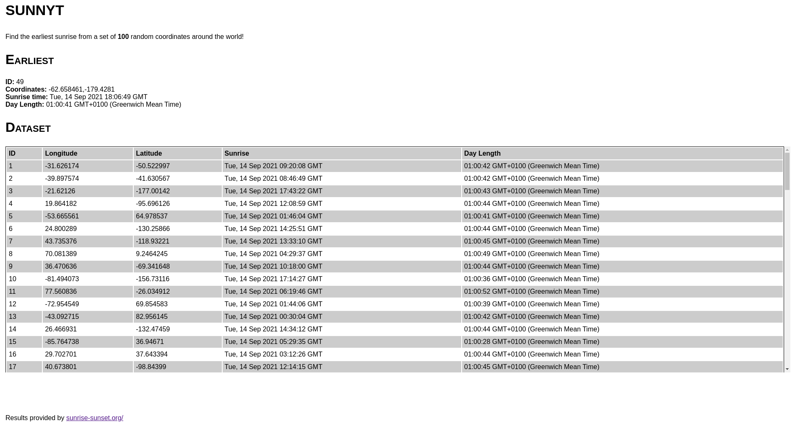

sunnyt
======

Generates a set of coordinates and makes requests to
[sunrise-sunset.org](https://sunrise-sunset.org/) to
fetch data about those coordinates sunrise and sunset
times and find out which one has the earliest sunrise.

Usage
-----

- `npm install` - install dependencies
- `npm start` - build & run the tool

Configuration
-------------

The tool is configured through a _./config.json_ file.
This file is required to run the tool.

- **datasetSize** = The number of coordinates to generate and fetch
data for
- **requestLimit** = The maximum number of requests to make to
sunrise-sunset.org

**Important:** Setting the _requestLimit_ too high might cause
sunrise-sunset.org to temporarily block your IP as a method to prevent
bots from flooding their servers. Any future requests after this will
recieve a ECONNREFUSED response. If this happens, you'll have to wait
for a period or proxy through another IP to make future requests.

Notes
-----

- Generally with the datasetSize set to 100 it returns at least one set
of coordinates that point to somewhere in east Russia, which has a
sunrise at 5-6pm (Greenwich Mean Time)
- **Sunrise in 1970?** - This happens when generated coordinates are
not in one of the countries
[supported by SunriseSunset](https://sunrise-sunset.org/explore). When
this happens their API returns epoch, such dates are ignored by sunnyt.
- This was my first project using Typescript, let me know if I'm doing
anything weird.

Future
------

- [ ] _should_ allow user to set coordinates and date parameters for requests
- [ ] _could_ Implement reverse geocoding to get the name of the location for the coordinates generated:
[Google Reverse Geocoding](https://developers.google.com/maps/documentation/javascript/geocoding#ReverseGeocoding)
- [ ] _could_ Make the webpage interactive
  - Add an interactive map to allow users to select coordinates
- [x] _could_  Output useful data in a tidy .html file using a templating language like [mustache](https://mustache.github.io/)

Authors
-------

- Alex Collins (alexander-collins@outlook.com)

